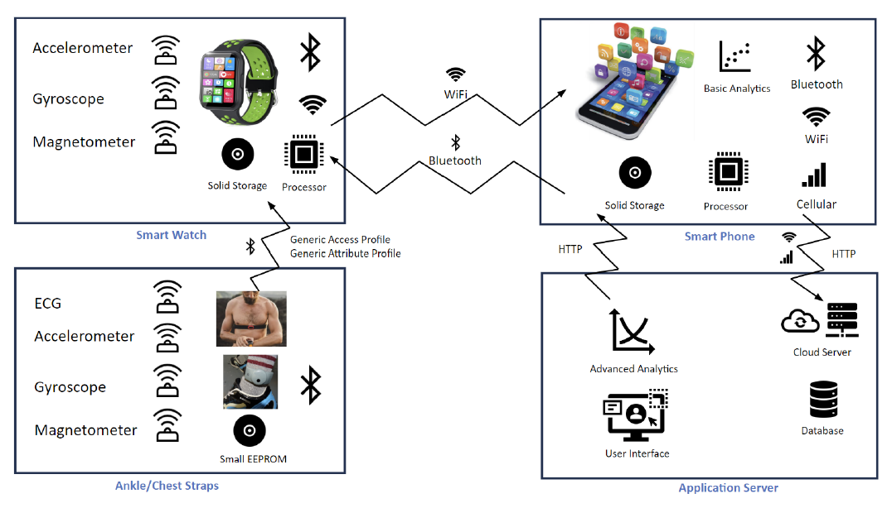
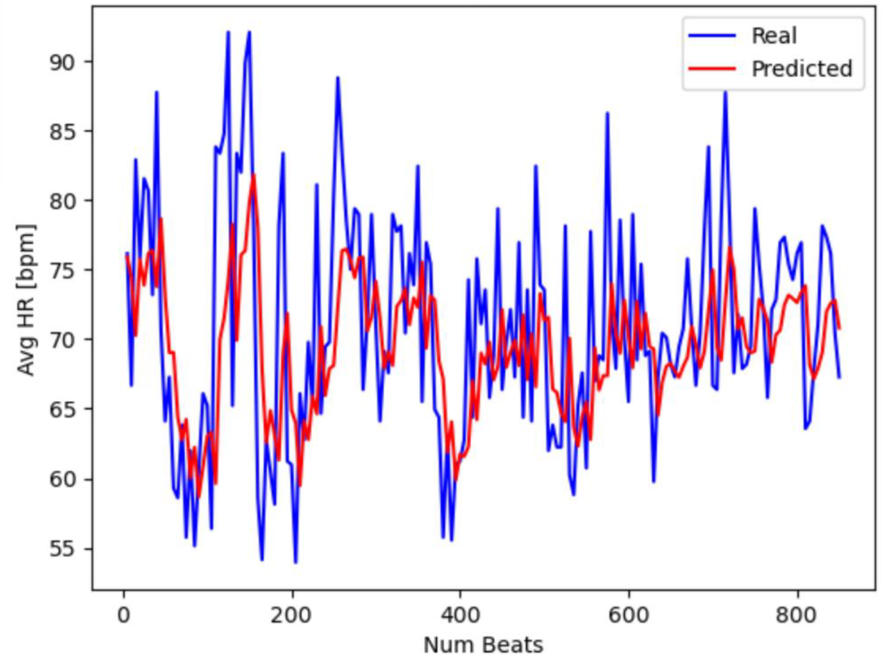
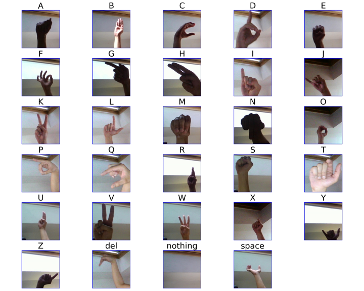
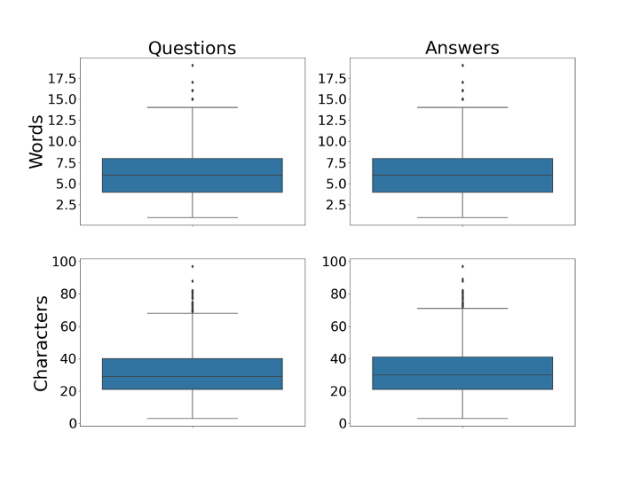

# Caterina Gallo
Hello! Welcome to my personal portfolio! 

## Projects
In the following you can find a list of projects developed during my MS in Applied Artificial Intelligence at San Diego University. 

### Study_Of_Obesity - [Github Link]()

Final Project of the course "Probability and Statistics for Artificial Intelligence"

Acuna, W., Gallo, C., & Mares, S. (n.d.). A Study of Obesity and the Relation to Physical Condition and Eating Habits [Unpublished manuscript]. Shiley-Marcos School of Engineering, University of San Diego

We analyzed an [existing dataset](https://archive.ics.uci.edu/dataset/544/estimation+of+obesity+levels+based+on+eating+habits+and+physical+condition) including 2111 records and 15 attributes possibly linked to different weight levels (underweight, normal, overweight I, overweight II, obesity I, obesity II and obesity III). 

We first identified the most important factors related to overweight and obesity by evaluating the relationships between the status of being overweight or obese (weight status: 0 for underweight or normal weight people and 1 for overweight or obese people) and each of the other available variables in our database (consumption of high caloric food, vegetables, food between meals, water and alcohol, number of main meals, calories monitoring, physical activity frequency, time using technology, transportation used, gender age, height, overweight family history and smoke). For categorical variables we relied on the chi-squared test of independence, while for numerical variables we used logistic regression. Assuming a significance level of 0.05, we recognized the variables having the strongest association with the weight status: number of meals per day, daily water consumption, physical activity frequency per week, time using technology per day, age and height. 

We then trained a decision tree classifier to predict if one is overweight/obese or not based on the variables with the highest impact on the weight status. The final model exhibited an accuracy of 85% and the values for precision, recall and f1-score were 0.9/0.72, 0.89/0.74 and 0.89/0.73 for people suffering/not suffering from overweight or obesity, respectively. Overall, the model performed reasonably well alghough a few limitations should be addressed. In fact, the data were self-reported, which could have led to biases and inaccuracies, and other potential factors potentially correlated with obesity such as genetics were neglected.

### COVID_Detection - [Github Link](https://github.com/CatGallo/COVID_Detection.git)

Final Project of the course "Introduction to Artificial Intelligence"

Gallo, C., Frederick, A., & Thai, P. (2023, April 17). Covid Detection Utilizing AI and ML - I Spy Covid With My Little Eye [Unpublished manuscript]. Shiley-Marcos School of Engineering, University of San Diego

We tested three different Convolutional Neural Network models, VGG16, ResNet50 and InceptionV3, to classify chest X-Ray images into normal or Covid-19 infected. 

To train and test these models we used the [Covid X-Ray Dataset](https://www.kaggle.com/datasets/ahemateja19bec1025/covid-xray-dataset) including 1301 images without Covid-19 (see Figure 1) and 1790 images with Covid-19 (see Figure 2). While image standardization and normalization were applied to the entire dataset, image augmentation was applied to the training set only (through rotation and by filling in any empty pixel after rotation with the nearest pixel value). 

<figure>
<figcaption>Figure 1 - Examples of images without Covid</figcaption>

</figure>

<figure>
<figcaption>Figure 2 - Examples of images with Covid</figcaption>

</figure>

VGG16 showed the highest performance with 94.2% accuracy, 98.5% sensitivity, and 91.1% specificity. InceptionV3 trailed closely with 93.4% accuracy, 93.5% sensitivity and 93.3% specificity, while ResNet50 had 84.7% accuracy, 91.6% sensitivity and 79.6% specificity. Despite the high scores associated with the three models, additional adjustments would be necessary in future model developments. The ResNet50 model would in fact require a greater number of epochs, which we reduced due to memory limitations. Also, the head layer structure and parameters like the learning rate should be individually optimized for each model instead of keeping them consistent across models,  as we did here to get a direct comparison. Finally, additional patient-specific information, e.g. the number of days from the first symptoms or the presence of other clinical conditions, could further improve the capability of our models to early detect Covid-19 and similar respiratory diseases like pneumonia. 

### QA_System - [Github Link]() - [Application Deployment](http://willacuna.pythonanywhere.com/projects)

Final Project of the course of "Natural Language Processing" 

Acuna, W., Gallo, C., & Ostrovsky, S. (2023, October 23). Question Answering System using DistilBERT [Unpublished manuscript]. Shiley-Marcos School of Engineering, University of San Diego

We developed a Question Answering (QA) system through the [DistilBERT model](https://huggingface.co/transformers/v4.3.3/custom_datasets.html?highlight=fine%20tune), which was fine-tuned on the [Standford Question Answering Dataset (SQuAD)] (https://huggingface.co/transformers/v4.3.3/custom_datasets.html?highlight=fine%20tune). 

The SQuAD dataset includes 87,599 training and 10,570 validation samples, each consisting of a paragraph, a context, a question and an answer. However, in order to expedite the development process, we relied on a reduced version of the original dataset, with 10,000 training and 1,200 validation samples. Also, we added to each sample additional information (the character position of the answer end in the contect as well as the the start and end token positions in the answers) to enhance model efficiency and effectiveness. 

### Text_To_Image - [Github Link](https://github.com/CatGallo/Text_To_Image.git) - [Application Deployment](https://huggingface.co/sglasher/van-gogh-stable-diffusion)

Final Project of the course of "Introduction to Computer Vision" 

Gallo, C., Krick, J., & Lasher, S. (2023, December 11). Text-to-Image Final Project [Unpublished manuscript]. Shiley-Marcos School of Engineering, University of San Diego

We developed a text-to-image model able to generate Van Gogh style pictures based on text prompts.

We exploited a [pre-trained model](https://huggingface.co/CompVis/stable-diffusion-v1-4) of Stable Diffusion available in Hugging Face, which hosts the [WikiArt dataset](https://huggingface.co/datasets/huggan/wikiart/viewer/default/train) comprising 103.250 pieces of art (paintings, drawings and sculptures). The pre-trained model was fine-tuned on a portion of the WikiArt dataset including images and descriptions of more than 400 Van Gogh's masterpieces. Figure 3 shows four images produced by the model for each of the following categories: cities, landscapes, sky flowers, professions and situations. 

<figure>
<figcaption>Figure 3 - Examples of images returned by the model in response to the prompts written above the panels</figcaption>

</figure>

The model was quantitatively evaluated through a couple of metrics normally used for diffusion models: the [CLIP score](https://huggingface.co/docs/diffusers/conceptual/evaluation) - to determine the similarity level between one or more labels and the corresponding images returned by the model - and the [Fréchet Inception Distance](https://huggingface.co/docs/diffusers/conceptual/evaluation) - to determine the similarity level between one or more sets of images, real and fake. We got an average CLIP score of 28.89 with the couples label-image reported in Figure 3, while a FID of 677.19 was found by comparing 16 real Van Gogh paintings with the corresponding images produced by the model based on the titles of the 16 real masterpieces. Also, in order to assess the quality of the output images, 16 users were asked to evaluate the output images by assigning a score from 1 to 5 to five different criteria: relevance to the initial prompt (4.56 ± 0.7), Van Gogh style (3.94 ± 1.34), complexity (4.0 ± 0.87), creativity (4.0 ± 1.12) and general satisfaction (4.38 ± 0.78). 

Based on the results described above, we think that the weakest point of our model is its inability to always generate Van Gogh style images. If the model is asked to show typical subjects of Van Gogh's pictures, like sunflowers and farmers, the images generated by the model will probably embody the style of the painter. Otherwise, output images might appear very distant from the works of the painter we want to imitate. To enhance our model performance, we could increase the size of the dataset used for training and testing, maybe including the paintings of other authors sharing the same artistic period. Hence the entire Van Gogh's production consists of around 900 pieces of art. Finally, the model should be judged by a greater number of users to make this kind of evaluation significant. 

### Human_Activity_Classification_Heart_Rate_Prediction - [Github Link]()

DeVoe, K., Gallo, C., & Tahiliani, P. (n.d.). Human Activity Classification and Heart Rate Prediction [Unpublished manuscript]. Shiley-Marcos School of Engineering, University of San Diego

Final Project of the course "Data Analytics and Internet of Things"

We proposed a physical activity tracking system that exploits machine learning algorithms to predict the physical activity of the user (among a list of 12 different activities: standing still, sitting relaxing, lying down, walking, cycling, jogging, running, climbing stairs, arm elevation, knee bend, waist bends and front back jump) and the average user's heart rate (HR) for the next 5-10 heartbeats. 

The IoT system includes a smartwatch, an ankle sensor and a chest sensor. While the chest sensor consists of an accelerometer to measure position and 2 electrocardiogram sensors, the smartwatch and the ankle sensors contain an accelerometer, a gyroscope to detect motion and a magnetometer to recognize changes in orientation. The chest and ankle sensors are also equipped with a Bluetooth connectivity module to transfer data to the smartwatch. The latter then runs the machine learning algorithms we developed in the form of edge processing and shows the final data in the form of key summary statistics for the user to see. A diagram of the IoT device is given in Figure 4, while an example of tableau dashboard for this IoT device is provided in Figure 5.

<figure>
<figcaption>Figure 4 - Structure and functioning of the IoT system </figcaption>

</figure>

<figure>
<figcaption>Figure 5 - Example of data the IoT system could show to user </figcaption>

</figure>

Our machine learning algorithms were built based on the [mHealth Dataset](https://archive.ics.uci.edu/dataset/319/mhealth+dataset), which reports the data recorded by the three sensors described above (a total of 24 features) for 10 different subjects. We combined the data files of the 10 subjects thereby obtaining a data frame of over 1.2 million entries. 

To classify the activity performed by the user we tested three different models, a K Nearest Neighbors (KNN) n = 6 model, a Support Vector Machine (SVM) model and a Random Forest Classifier (RFC) model with the scikit-learn default number of estimators set at 100. Input data were extracted from the time series recorded by all the sensors for the first 6 subjects, by calculating the rolling average and standard deviation over a set period of 4 seconds for each of the available features. The RFC model showed the best overall performance with a 92.9% validation accuracy and a 97.9% accuracy on the testing set. We verified that our RFC model can misclassify climbing stairs with walking and knee bends, thereby leading to sporadic errors. 

To predict the average user's HR for the next 5-10 heartbeats, we adopted an LSTM model. This time, considering that ECGs can drammatically change from one subject to another, we trained one subject-specific LSTM model starting from one ECG signal of one subject only. The training set is nothing more than a sequence of average HR values, with each HR value representing the average of 5 sequential HRs in a portion of the original HR sequence extracted from the ECG signal of the chosen subject. HRs can be calculated as 60/RRs, with RRs the distances between siccessive peaks in an ECG signal. By comparing the real and predicted average seguence of HR values for the chosen subject (see Figure 6), we got the following errors: mean+/-std: -0.94+/-13.37%, 25th percentile: -9.77%, 50th percentile: -0.14%, 75th percentile: 8.80%. In actual fact, the man error is very low the errors within the 25th and 75th percentiles are in acceptable for our application.

<figure>
<figcaption>Figure 6 - Comparison between real and predicted average HR sequences for one subject </figcaption>

</figure>

### AS_Linguist - [Github Link]()

Adhikari, S., Gallo, C., & Thai, P. (2024, August 12). A.S. Linguist Final Project [Unpublished manuscript]. Shiley-Marcos School of Engineering, University of San Diego

Final Project of the course "Capstone Project"

We developed an application able to understand live sign language questions and retun textual and sign language answers on general topics. Such a technology could be useful to deaf and dumb people who knows the American Sign Language (ASL), which is the most common sign language in North America. 

For this project we built two machine learning models - a convolutional neural network (CNN) and a [Flan-T5-Base chatbot model](https://huggingface.co/google/flan-t5-base) - and an application to interact with the two models. The CNN was used as sign language interpreter, while the Flan-T5-Base chatbot model was adopted to hold on textual conversation. Our final application, which was built in Streamlit, collects the user's sign language gestures through a camera, manages the flow of data in and out the two machine learning models, and shows the chatbot response to the user as both a text and a sequence of ASL images. 

The CNN model was trained on the [ASL Alphabet Dataset](https://www.kaggle.com/datasets/grassknoted/asl-alphabet), which consists of 3000 images for each of the 26 letters of the US alphabet and for three additional signs: "space", "delete" and "nothing" (see Figure 7). All images were rescaled and converted to grayscale, and different augmentation techniques (rotation, horizontal and vertical shifting, shearing, zooming and horizontal flipping) were applied to the training set of images. The chatbot model was fine-tuned on the [3K Conversations Dataset for ChatBot](https://www.kaggle.com/datasets/kreeshrajani/3k-conversations-dataset-for-chatbot), which includes 3725 questions and answers, each containing around 6 words and 31 characters (see Figure 8). During text preprocessing, we removed contractions, eliminated punctuation and applied lowercasing. 

<figure>
<figcaption>Figure 7 -  Images extracted from the ASL Alphabet Dataset for all the 29 classes </figcaption>

</figure>

<figure>
<figcaption>Figure 8 - Boxplots of the number of words and characters in questions and answers of the 3K Conversations Dataset for chatbot </figcaption>

</figure>

We verified the good functioning of the CNN model on a set of 87000 different sign language images, and obtained a model acuracy of 0.99 and the macro/weighted averages of the test precision, recall and f1-score equal to 0.99. Regarding the chatbot model, its performance was qualitatively evaluated through an initial list of 20 questions (see Table 1), which should be expanded in the future. In general, model answers are consistent with questions but can be wrong or vague. Also, grammar and punctuation are not always appropriate, and "how" is often confused for "what". Thus, if the CNN model already exhibits a very good performance, the chatbot model still requires a few improvements, involving a bigger training dataset to allow a broader range of prompts and maybe an alternative pretrained model.

<table>
  <caption>Table 1 - List of questions asked to the chatbot model and its answers</caption>
  <tr>
    <th>ID</th>
    <th>Question Text</th>
    <th>Answer Text</th>
  </tr>
  <tr>
    <td>1</td>
    <td>Hello, how are you?</td>
    <td>I'm fine</td>
  </tr>
  <tr>
    <td>2</td>
    <td>What is your name?</td>
    <td>samuel samuel</td>
  </tr>
  <tr>
    <td>3</td>
    <td>Are you happy today?</td>
    <td>I am happy</td>
  </tr>
  <tr>
    <td>4</td>
    <td>What is your favorite color?</td>
    <td>blue</td>
  </tr>
  <tr>
    <td>5</td>
    <td>What is your dream?</td>
    <td>i want to be a good man</td>
  </tr>
  <tr>
    <td>6</td>
    <td>Do you think it will rain in the afternoon?</td>
    <td>It will be cloudy</td>
  </tr>
  <tr>
    <td>7</td>
    <td>What is the capital of California?</td>
    <td>san francisco</td>
  </tr>
  <tr>
    <td>8</td>
    <td>What is the capital of Italy?</td>
    <td>Rome</td>
  </tr>
  <tr>
    <td>9</td>
    <td>When does summer begin?</td>
    <td>summer</td>
  </tr>
  <tr>
    <td>10</td>
    <td>What is the best drink for a hangover?</td>
    <td>a stout</td>
  </tr>
  <tr>
    <td>11</td>
    <td>What is the probability that two apples will fall at the same time?</td>
    <td>1/2</td>
  </tr>
  <tr>
    <td>12</td>
    <td>Do you know the definition of artificial intelligence?</td>
    <td>No</td>
  </tr>
  <tr>
    <td>13</td>
    <td>Could you please recommend an American dish?</td>
    <td>a fried chicken sandwich</td>
  </tr>
  <tr>
    <td>14</td>
    <td>Where would you go on vacation this summer?</td>
    <td>sweden</td>
  </tr>
  <tr>
    <td>15</td>
    <td>What is Buddhism?</td>
    <td>Buddhism is a religion</td>
  </tr>
  <tr>
    <td>16</td>
    <td>Could you suggest a person's name with C?</td>
    <td>charlie cleveland</td>
  </tr>
  <tr>
    <td>17</td>
    <td>Who is Chris Martin?</td>
    <td>british actor</td>
  </tr>
  <tr>
    <td>18</td>
    <td>When will next Easter be celebrated?</td>
    <td>in the spring</td>
  </tr>
  <tr>
    <td>19</td>
    <td>What is rosemary?</td>
    <td>rosemary is a genus of plants</td>
  </tr>
  <tr>
    <td>20</td>
    <td>What would you do in case of dehydration?</td>
    <td>drink water</td>
  </tr>
</table>

## Contacts
You can reach me at [LinkedIn](https://www.linkedin.com/in/caterina-gallo) or [GitHub](https://github.com/CatGallo).
